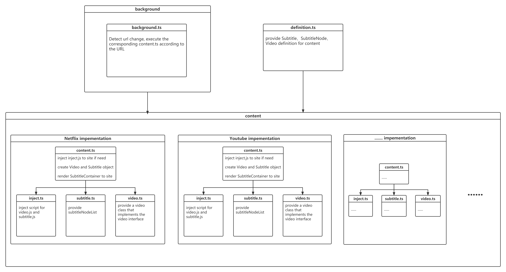

# Chrome Dictionary Extension


A Chrome dictionary extension that provide functions such as translation and Anki card making when watching video on Netflix, Youtube, Local File, etc.

## Setup

```
npm install
```

## Build

```
npm run build
```

## Build in watch mode

```
npm run watch
```

## Load extension to chrome

Load `dist` directory

## Architecture


